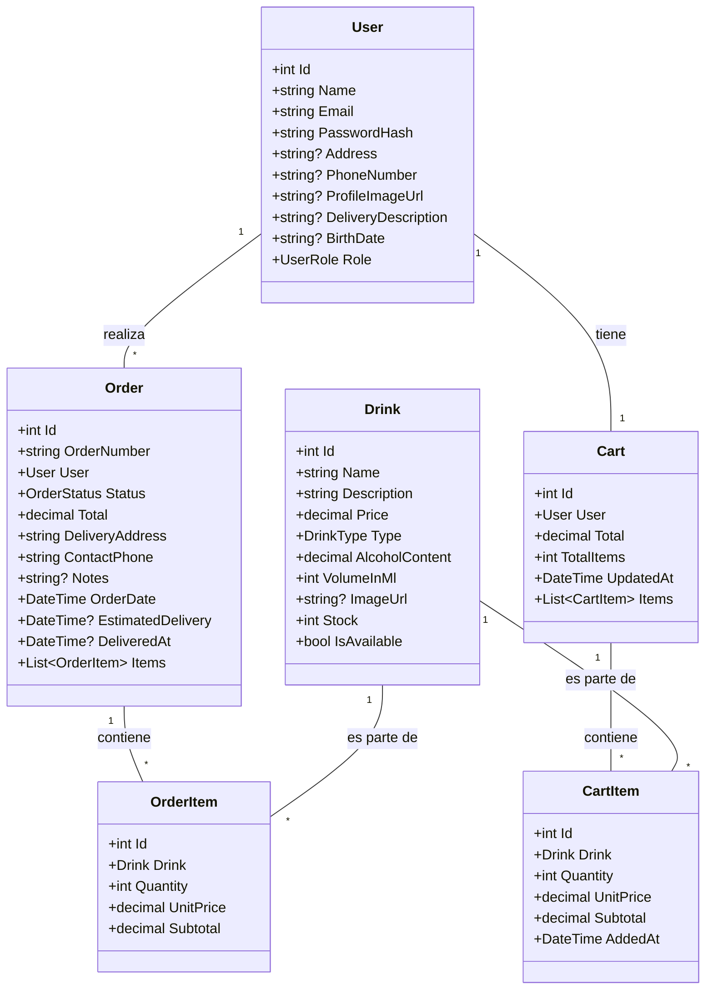

# Gunter Bar - DER y UML

## DER (Diagrama Entidad-Relación)

```mermaid
erDiagram
  USER {
    int Id PK
    string Name
    string Email
    string PasswordHash
    string? Address
    string? PhoneNumber
    string? ProfileImageUrl
    string? DeliveryDescription
    string? BirthDate
    int Role
  }
  DRINK {
    int Id PK
    string Name
    string Description
    decimal Price
    int Type
    decimal AlcoholContent
    int VolumeInMl
    string? ImageUrl
    int Stock
    bool IsAvailable
  }
  ORDER {
    int Id PK
    string OrderNumber
    int UserId FK
    int Status
    decimal Total
    string DeliveryAddress
    string ContactPhone
    string? Notes
    datetime OrderDate
    datetime? EstimatedDelivery
    datetime? DeliveredAt
  }
  ORDER_ITEM {
    int Id PK
    int OrderId FK
    int DrinkId FK
    int Quantity
    decimal UnitPrice
    decimal Subtotal
  }
  CART {
    int Id PK
    int UserId FK
    decimal Total
    int TotalItems
    datetime UpdatedAt
  }
  CART_ITEM {
    int Id PK
    int CartId FK
    int DrinkId FK
    int Quantity
    decimal UnitPrice
    decimal Subtotal
    datetime AddedAt
  }
  USER ||--o{ ORDER : "realiza"
  ORDER ||--|{ ORDER_ITEM : "contiene"
  DRINK ||--o{ ORDER_ITEM : "es parte de"
  USER ||--o{ CART : "tiene"
  CART ||--|{ CART_ITEM : "contiene"
  DRINK ||--o{ CART_ITEM : "es parte de"
```

## UML (Diagrama de Clases Simplificado)


